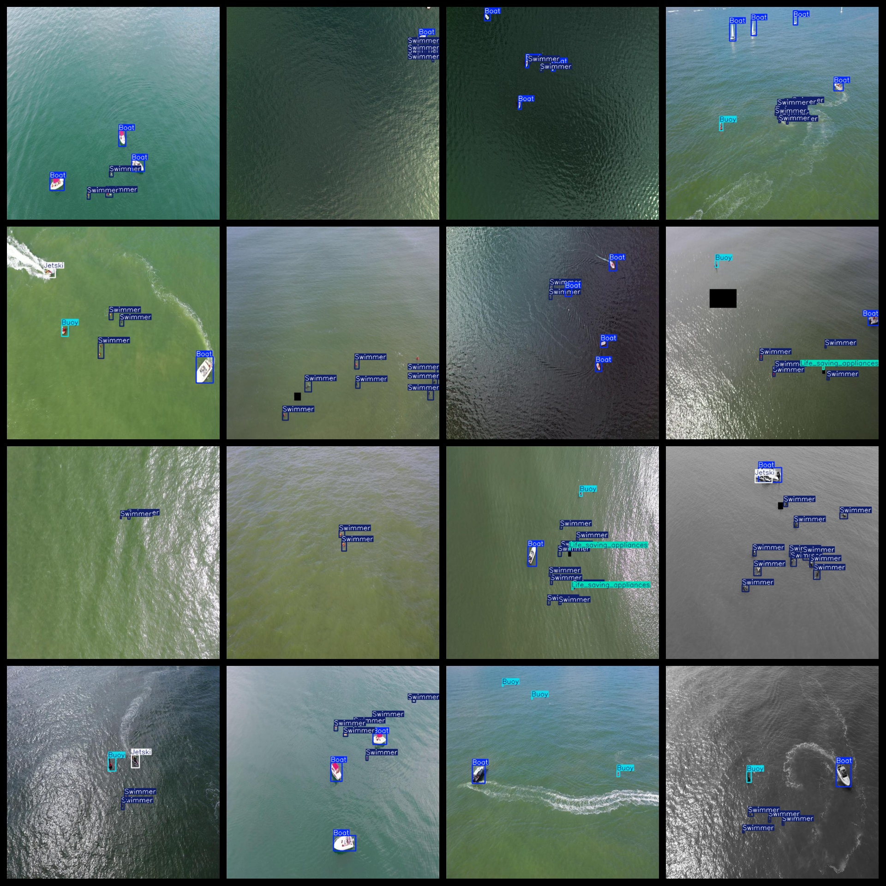

# Aerial Boat Buoy Swimmer Dataset 9984 images VOC+YOLO format

The dataset includes 9984 aerial images of boats, buoys and swimmers, in Pascal VOC and YOLO format. The txt files do not contain segmentation paths but only contain the jpg images and their corresponding VOC and yolo txt files.

Number of images: 9984 jpg images

Number of annotations: 9984 xml files

Number of annotations: 9984 txt files

Number of callout categories: 5

GitHub repository: datasets_sl

["Boat", "Buoy", "Jetski", "Life_saving_appliances", "Swimmer"]

Tags: Ship, Buoy, Motorboat, Life Saving Devices, Swimmer

Number of boxes labeled in each category:

- Boat frame count = 13825
- Buoy frame count = 4653
- Jetski frame count = 2666
- Life_saving_appliances frame count = 1161
- Swimmer frame count = 39669
Total frame count: 61974

Number of images per category:

- Boat occupancy image count = 6323
- Buoy occupancy = 3857
- Jetski owns 2660 images
- Life_saving_appliances occupies = 811
- Number of swimmers = 7657

Image resolution: 640x640

Use the labeling tool: labelImg

Dataset Augmentation: Yes

Rules for annotation: Draw a rectangle around the category.

Important Note: The dataset has not been split into training, validation, and test sets; you need to do so yourself.

Special Disclaimer: This dataset does not guarantee the accuracy of the trained model or weight files.
## Images

---

Here is a pay link on Stripe (https://buy.stripe.com/3cs8yP7sY87d0vu9AB). Please contact me lonlonago@foxmail.com after funding $89, and I will send you a complete data files, thank you!

